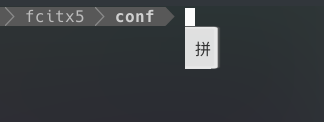
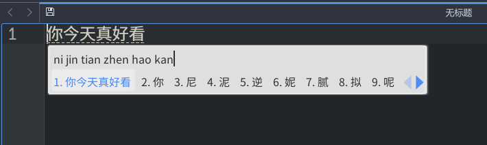

# simple blue

A simple theme for fcitx5 modified from [Simple](https://github.com/iovxw/fcitx5-simple-theme) and [Fcitx5 Default](https://github.com/fcitx/fcitx5).

## Screenshot

- InputMethod Change Content</br>
</br>

- Input Horizontal</br>
</br>

- Input Vertial</br>
</br>

## Install
### Fcitx5
For Arch Linux users:</br>
Try out fcitx5 by using the following command:
```bash
yay -S fcitx5-git fcitx5-qt5-git fcitx5-gtk-git fcitx5-chinese-addons-git
```
If you have added the `Arch Linux CN Repo`, please install directly from archlinuxcn.</br>

Then add the following lines:
- xorg: to `~/.xprofile`

```bash
export GTK_IM_MODULE=fcitx5
export XMODIFIERS="@im=fcitx"
export QT_IM_MODULE=fcitx5
fcitx5 > /dev/null &
```

- wayland: to `~/.pam_environment`

```bash
GTK_IM_MODULE DEFAULT=fcitx5
QT_IM_MODULE DEFAULT=fcitx5
XMODIFIERS DEFAULT=@im=fcitx5
```
Also, you should add the following lines to `~/.config/fcitx5/profile`:
```
[Groups/0]
# Group Name
Name=Default
# Layout
Default Layout=us
# Default Input Method
DefaultIM=pinyin

[Groups/0/Items/0]
# Name
Name=keyboard-us
# Layout
Layout=

[Groups/0/Items/1]
# Name
Name=pinyin
# Layout
Layout=

[GroupOrder]
0=Default
```

If you want to change settings in kde system settings, you should install package `fcitx5-kcm-git`.

### Fcitx5-skin-simple-blue
First, clone the repo to `~/.local/shre/fcitx5/themes/`

```bash
git clone https://github.com/weearc/fcitx5-skin-simple-blue.git  ~/.local/share/fcitx5/themes/simple-blue
```

Add the following to your `~/.config/fcitx5/conf/classicui.conf`

```ini
# True, if you want a vertical candidate list
Vertical Candidate List=False
Theme=simple-blue
```

**Every time you change the settings please reload fcitx5**

## License

This is free and unencumbered software released into the public domain.

Anyone is free to copy, modify, publish, use, compile, sell, or distribute this software, either in source code form or as a compiled binary, for any purpose, commercial or non-commercial, and by any means.
